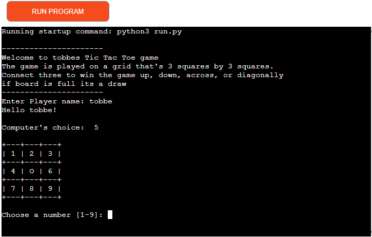
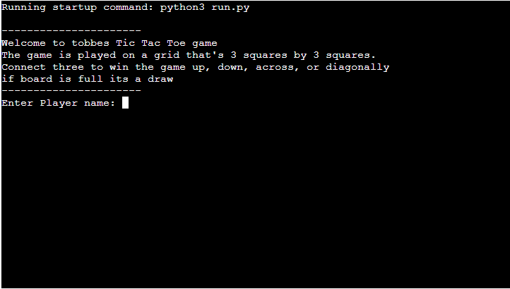
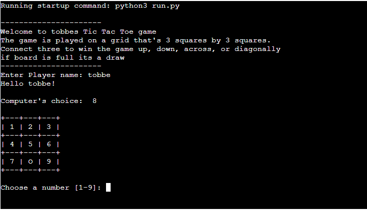
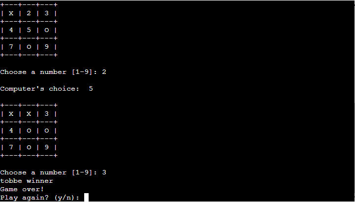
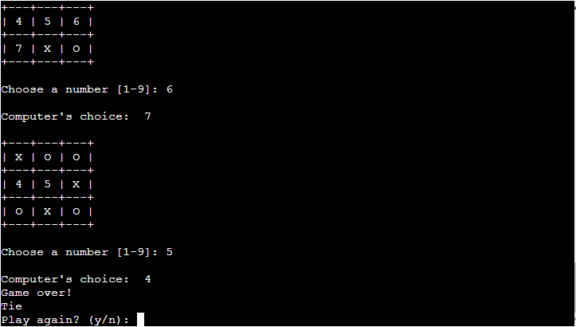
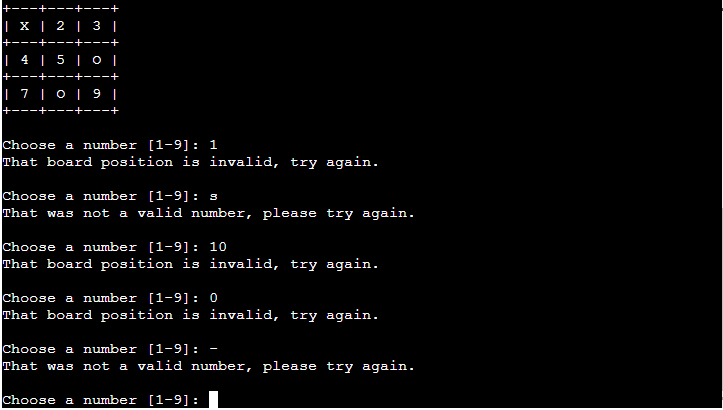
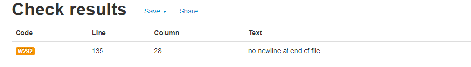
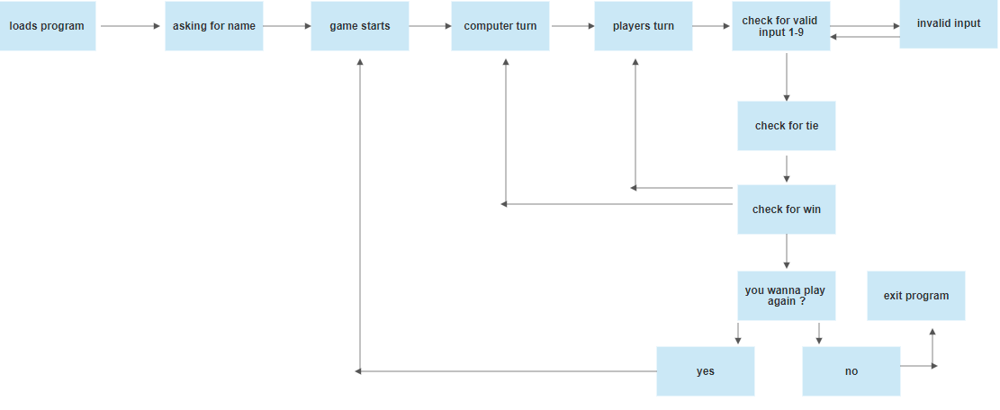

# **Tobbes TictacToe**

This Tictactoe is a game that you run in the Code institutes mock terminal in Heroku.

[Here is the live version of the Tictactoe game](https://tictactoetobbe.herokuapp.com/)

# **How to play**

1. The game is played on a grid that's 3 squares by 3 squares.

2. You are X, the computer in this case is O. Players take turns putting their marks in empty squares.

3. The first player to get 3 of their marks in a row (up, down, across, or diagonally) is the winner.

4. When all 9 squares are full, the game is over. If no player has 3 marks in a row, the game ends in a tie.

# **Features/Testing**

## Welcome screen

- Welcome screen that greets you with the basic rules of the game.
- Asks user name input to start the game.

## Game starts

- After name input the gameboard is printed out.
- The computer makes the first move.
- Each player takes turns until there is a winner or a draw.

## Game winner or tie

- If player or computer connects 3 in a row game stop.
- If all 3x3 on the board are full it will give you a tie message.
- If you win or tie Game asks if you wanna exit the game or play again with inputs y/n.

### If winner

### If tie

## Invalid inputs

- While playing the game if you use any input that isn't 1-9 game asks for input again.
- No letters are allowed or numbers below 1 or over 9 and already picked numbers.
- If you use a wrong input, it will just ask you forever until you put a valid one in the terminal.

## Code tested

- The code is tested for no errors found in the gitpod terminal and on Heroku manually.
- Tested all win conditions, tested tie, tested all different characters to see if it would crash instead of asking for input again.
- Tested code in PEP8 1 error "w292 no newline at end of file" But that is a known error and accepted.
- Did a lot of code testing to be validated with pep8 and to fix those errors that occurred.

# Bugs

I had a lot of problems with "Line too long (82 &gt; 79 characters) (E501)" on the entire checkForWinner section of the code. 
if gameBoard[0][0] == "X" and gameBoard[0][1] == "X" and gameBoard[0][2] == "X": 
        print(player, "winner") 
        return "X" 

But that code was too long and i tried to write it with a backslash. 
if gameBoard[0][0] == "X" and gameBoard[0][1] == \ 
"X" and gameBoard[0][2] == "X"  : 
        print(player, "winner") 
        return "X" 

Also tried with parentheses. 
if (gameBoard[0][0] == "X" and gameBoard[0][1] == "X" 
and gameBoard[0][2] == "X"): 

The ways I tried didn't work and crashed my code and when swapping gameboard to board the characters got less and had no error. 
I could fix it with as well # noqa: E501 at the end of the codeline. 
But if I used that it would be to many lines and it wouldn't look good so just better to change gameboard to game. 

## Unsolved bugs

None that I came across. 

# Strategy

### User needs

- Rules Explained before the game starts.
- Ability to enter name to play as.
- Easy play with no errors and if you do wrong inputs you can try again.
- Can be run on any device.
- Able to continue to play or exit out of the game.

### Project goals

My goal in this game is to give a fun experience for the user with easy step by step gameplay. 
Decide to quit the game or continue to play. 
A game that is interesting for all ages. 

### Target audience

Anyone looking for a tictactoe game to play against the computer. 
This game is developed for any age that can read and follow simple instructions. 

# Future of the game

- Add so you can play player vs player and not only vs computer. 
- Add so the game keeps score if you play for a longer sessions how many times each has won. 
- Make computer smarter so the game gets harder in different levels you can choose. 

# Flow chart

# Technologies i used

Code institute python template. 
Github and Gitpod - coded the project in gitpod and uploaded it to github. 
Heroku - deployed the game to run. 
PEP8 

## Import

I used import random to set up so the computer could choose a random number.

# Deployment

1. Signed up to Heroku.
2. Click create new app.
3. I choose a name and region Europe.
4. Click create app button.
5. Go to settings and choose build packs.
6. Then i choose python and node.js pack checking so python is first then node.js.
7. Go to deploy section.
8. choose github and set it up to be able to be used by Heroku.
9. find my github repository i wanna submit in the search function.
10. choose main branch and deploy using the manual metod.
11. I choose Manual deployment cause i wanna deploy it Manualy you can also choose Automatic and it will update it on every git push.

# Credits

- [Stackoverflow](https://stackoverflow.com/) 
- [Askpython](https://www.askpython.com/python/examples/tic-tac-toe-using-python) 
- [Youtube](https://www.youtube.com/watch?v=M3G1ZgOMFxo) Shaun Halverson youtube 
- My mentor Ronan 

